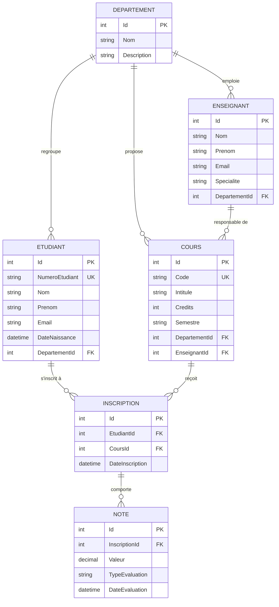
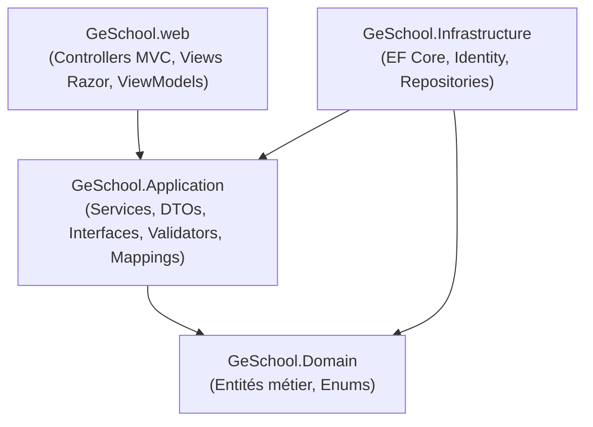

# Rapport de projet — GeSchool (Gestion de la Scolarité)

**Module** : Programmation Web Avancée / Architectures Logicielles
**Technologies imposées** : ASP.NET Core MVC (.NET 8), Entity Framework Core, SQL Server

---

## 1. Introduction et contexte

GeSchool est une application web de gestion de la scolarité universitaire, développée dans le cadre du module *Programmation Web Avancée*. L'objectif pédagogique dépasse la simple réalisation d'un CRUD : il s'agit de mettre en pratique une architecture logicielle en couches, un modèle de données relationnel cohérent, la sécurisation d'une application MVC avec ASP.NET Core Identity, et les bonnes pratiques de génie logiciel (séparation des responsabilités, validation, gestion des erreurs, expérience utilisateur).

L'application permet à un établissement de gérer numériquement l'ensemble du cycle académique de ses étudiants : départements, enseignants, cours, inscriptions, notes et bulletins, avec trois profils utilisateurs aux droits différenciés.

---

## 2. Cahier des charges reformulé

### 2.1 Profils utilisateurs et droits

| Rôle | Droits |
|---|---|
| **Administrateur** | Gestion complète de tous les référentiels (départements, enseignants, étudiants, cours, inscriptions, notes) et des comptes utilisateurs. Consultation de tous les bulletins. |
| **Enseignant** | Consultation des étudiants et des cours **dont il est responsable uniquement**. Gestion (création/modification/suppression) des inscriptions et saisie des notes, **limitée à ses propres cours**. |
| **Étudiant** | Consultation de son profil, de ses cours (via ses inscriptions) et de son bulletin (moyennes par cours et moyenne générale). |

### 2.2 Fonctionnalités par domaine

- **Départements** : CRUD (nom, description). Un département regroupe des enseignants, des étudiants et des cours.
- **Enseignants** : CRUD (nom, prénom, email, spécialité), rattaché à un département, responsable de plusieurs cours.
- **Étudiants** : CRUD (numéro étudiant unique, nom, prénom, email, date de naissance), rattaché à un département, inscrit à plusieurs cours.
- **Cours** : CRUD (code unique, intitulé, crédits, semestre), rattaché à un département et à un enseignant responsable.
- **Inscriptions** : inscription d'un étudiant à un cours (contrainte : un étudiant ne peut être inscrit qu'une fois au même cours), consultation, annulation (avec suppression des notes associées).
- **Notes et bulletin** : saisie d'une ou plusieurs notes (0–20) par inscription avec un type d'évaluation (contrôle continu, TP, examen, projet) ; calcul automatique de la moyenne par cours ; génération d'un bulletin par étudiant affichant la moyenne de chaque cours suivi ainsi qu'une moyenne générale pondérée par les crédits des cours.
- **Authentification et autorisations** : connexion des utilisateurs, trois rôles avec permissions différenciées, restriction de l'accès aux pages de gestion aux utilisateurs authentifiés et autorisés.

---

## 3. Modèle de données

### 3.1 Diagramme entité-association



### 3.2 Contraintes d'intégrité

| Contrainte | Implémentation |
|---|---|
| `Etudiant.NumeroEtudiant` unique | Index unique (`EtudiantConfiguration`) |
| `Cours.Code` unique | Index unique (`CoursConfiguration`) |
| `Cours.Credits > 0` | Check constraint SQL + validation FluentValidation |
| `Note.Valeur` entre 0 et 20 | Check constraint SQL + validation FluentValidation |
| Un étudiant ne peut être inscrit deux fois au même cours | Index unique composite `(EtudiantId, CoursId)` sur `Inscription` |
| Suppression d'une inscription → suppression des notes associées | `DeleteBehavior.Cascade` sur `Inscription → Note` (seule relation en cascade du modèle) |
| Toutes les autres relations (Departement→Enseignant/Etudiant/Cours, Enseignant→Cours, Etudiant→Inscription, Cours→Inscription) | `DeleteBehavior.Restrict` — empêche la suppression d'une entité encore référencée, et évite l'erreur SQL Server *"multiple cascade paths"* (un `Cours` étant atteignable à la fois via `Departement` et via `Enseignant`) |

---

## 4. Architecture logicielle

### 4.1 Vue en couches



Règle de dépendance stricte : `Domain` ne référence aucun autre projet ; `Application` ne référence que `Domain` ; `Infrastructure` référence `Application` et `Domain` ; `Web` référence `Application` et `Infrastructure` — **jamais directement `Domain`**, et **aucun controller n'accède directement à `ApplicationDbContext`**.

### 4.2 Pattern Repository + Service

Chaque entité dispose d'une interface `I{Entite}Repository` (Application) implémentée dans Infrastructure via un `Repository<T>` générique, et d'un service applicatif `I{Entite}Service`/`{Entite}Service` qui orchestre repository + mapping (AutoMapper) + retourne des DTOs — jamais les entités Domain directement aux controllers.

### 4.3 Flux d'une requête type

```
Vue Razor → Controller (Web) → I{Entite}Service (Application)
    → I{Entite}Repository (Application, implémenté dans Infrastructure)
    → ApplicationDbContext (Infrastructure) → SQL Server
```

Le controller ne connaît que l'interface de service ; il ignore totalement Entity Framework.

---

## 5. Choix techniques et justifications

| Choix | Justification |
|---|---|
| **Repository + Service** plutôt qu'accès direct aux DbContext depuis Application | Isole Application d'EF Core (remplaçable), respecte la contrainte imposée « les contrôleurs ne doivent jamais accéder directement à Entity Framework » en l'élargissant à toute la couche Application |
| **AutoMapper** pour Entité ↔ DTO | Évite le mapping manuel répétitif sur 6 entités × 3 DTOs (Create/Update/Read) |
| **FluentValidation** plutôt que Data Annotations | Garde les règles métier dans la couche Application (testable indépendamment de la couche présentation), plutôt que dispersées sur des attributs. *Divergence documentée par rapport à la contrainte imposée (Data Annotations) — conséquence : validation client partielle, voir §7.4.* |
| **DTOs consommés directement par les Vues** (pas de ViewModels dupliqués) | Les DTOs Application sont déjà la forme adaptée à l'UI ; dupliquer en ViewModels Web n'aurait rien apporté pour les CRUD simples. Des ViewModels Web ne sont introduits que lorsque la vue a un besoin propre non couvert par un DTO (ex. `CreateUserViewModel` avec mot de passe, `DashboardViewModel` avec des agrégats) |
| **Autorisation par rôle + filtrage applicatif** pour l'Enseignant | Plutôt que dupliquer les controllers CRUD pour un rôle "Enseignant", les controllers existants (`Cours`, `Etudiants`, `Inscriptions`, `Notes`) sont étendus : `[Authorize(Roles="Administrateur,Enseignant")]` au niveau classe, `[Authorize(Roles="Administrateur")]` au niveau des actions de mutation (les deux attributs se cumulent), et un filtrage explicite des données + une vérification d'appartenance sur les accès directs par ID (protection contre la manipulation d'URL/formulaire) |
| **Compte Enseignant/Étudiant lié via `ApplicationUser.EnseignantId`/`EtudiantId`** | Évite de dupliquer les informations d'identité entre `Identity` et les entités métier ; la liaison se fait au moment de la création du compte par l'Administrateur |
| **Bootstrap 5 conservé + design system maison par-dessus** | Bootstrap fournit déjà grid/modales/offcanvas ; plutôt que de le remplacer, un ensemble de variables CSS et de classes de composants (`.gs-table`, `.btn`, `.badge-soft`, `.kpi-card`…) construit une identité visuelle cohérente sans introduire de nouvelle dépendance JS |
| **Icônes Lucide vendorisées en SVG inline** (`IconHelper.cs`) | Cohérent avec le reste du projet (Bootstrap/jQuery déjà vendorisés localement, pas de CDN) ; zéro requête réseau, zéro dépendance JS supplémentaire |

---

## 6. Fonctionnalités implémentées par rôle

- **Administrateur** : CRUD complet sur les 6 entités métier, gestion des utilisateurs (création avec assignation de rôle et liaison optionnelle à une fiche Enseignant/Étudiant, suppression avec garde-fous), consultation de tous les bulletins, tableau de bord avec indicateurs réels (effectifs).
- **Enseignant** : consultation de ses cours et des étudiants qui y sont inscrits, gestion (création/modification/suppression) des inscriptions et des notes pour ses cours uniquement. Toute tentative d'accès à une ressource hors de son périmètre (via URL ou formulaire manipulé) est refusée.
- **Étudiant** : consultation de son profil, de ses cours suivis, et de son bulletin (moyennes par cours et moyenne générale pondérée par crédits).

---

## 7. Difficultés rencontrées et solutions apportées

### 7.1 `AddIdentity` indisponible dans une class library

`AddIdentity<TUser, TRole>()` fait partie du *shared framework* ASP.NET Core (`Microsoft.AspNetCore.App`), non disponible par défaut dans un projet `Microsoft.NET.Sdk` classique (`GeSchool.Infrastructure`). **Solution** : ajout explicite de `<FrameworkReference Include="Microsoft.AspNetCore.App" />` dans le `.csproj` d'Infrastructure.

### 7.2 Bug de culture invariante sur les décimales

La saisie d'une note (`Note.Valeur`, `decimal`) était silencieusement tronquée à `0.00` : le serveur, tournant sous une culture régionale utilisant la virgule comme séparateur décimal, rejetait la valeur postée avec un point (`"15.5"`). **Solution** : `CultureInfo.DefaultThreadCurrentCulture = CultureInfo.InvariantCulture` au démarrage de `Program.cs`, et champ `Valeur` en `<input type="number">` pour garantir un point décimal cohérent avec la culture invariante côté client comme serveur. Ce bug, découvert lors des tests manuels de bout en bout, illustre l'intérêt de tester réellement la soumission de formulaires plutôt que de se fier uniquement à la compilation.

### 7.3 Collision de nom entre une action `View` et `Controller.View()`

Une première implémentation du contrôleur Bulletin nommait l'action de consultation `View(int id)` — masquant par héritage (*method hiding* en C#) toutes les surcharges de `Controller.View(...)`, rendant l'appel `return View(bulletin);` impossible à l'intérieur de cette même action. **Solution** : renommage de l'action en `Details`, cohérent avec la convention déjà utilisée sur les autres controllers.

### 7.4 FluentValidation n'élimine pas totalement la validation implicite ASP.NET Core

Avec `<Nullable>enable</Nullable>`, ASP.NET Core MVC traite les propriétés `string` non-nullables comme implicitement requises au moment du binding, indépendamment de toute validation explicite. Conséquence : les messages d'erreur affichés sur les champs texte obligatoires proviennent de ce mécanisme implicite (en anglais, *"The X field is required."*) et non de FluentValidation, alors que les règles numériques (`Credits > 0`, `Valeur` 0–20) sont bien celles de FluentValidation (en français, correctement localisées). Documenté comme limite connue plutôt que "corrigé", car le comportement fonctionnel reste correct.

### 7.5 Contraintes de suppression en cascade multiples (SQL Server)

Une configuration initiale trop permissive des suppressions en cascade sur `Departement→Cours` et `Enseignant→Cours` simultanément aurait provoqué l'erreur SQL Server *"introducing FOREIGN KEY constraint may cause cycles or multiple cascade paths"* (`Cours` étant atteignable par les deux chemins). **Solution** : une seule relation en cascade dans tout le modèle (`Inscription → Note`, seule relation dont la suppression du "parent" n'a aucun sens sans le "parent"), toutes les autres en `Restrict`.

### 7.6 Verrouillage de fichier pendant le build

Plusieurs `dotnet build` ont échoué avec *"The process cannot access the file GeSchool.web.exe"* car l'application était encore en cours d'exécution depuis un lancement précédent. Rappel opérationnel plutôt que bug applicatif : toujours arrêter le processus avant de recompiler.

---

## 8. Limites connues et pistes d'amélioration

- **Pas d'inscription publique** (voir README, §Choix assumés) — les comptes sont créés par un Administrateur uniquement.
- **Pas d'édition ni de liaison rétroactive** d'un compte utilisateur existant à une fiche Etudiant/Enseignant — seulement à la création.
- **Validation côté client incomplète** pour les règles métier portées par FluentValidation (voir §7.4).
- **Moyenne du bulletin non pondérée par type d'évaluation** : toutes les notes d'un même cours (contrôle continu, TP, examen, projet) comptent à parts égales dans la moyenne du cours — une pondération par type (ex. Examen = 50 %) serait une évolution naturelle.
- **Pas de pagination serveur** sur les listes (un composant de pagination visuel est prêt côté UI mais non branché à une vraie requête paginée) — recherche uniquement côté client, adapté au volume actuel de données.
- **Pas d'historique/audit** : le tableau de bord affiche des tendances et une activité récente illustratives (clairement identifiées comme telles dans l'interface), faute d'un modèle de suivi temporel dans le domaine actuel.

---

## 9. Conclusion

GeSchool met en œuvre une architecture en couches strictement respectée (Domain/Application/Infrastructure/Web), un modèle de données relationnel conforme au cahier des charges, une authentification par rôles avec une autorisation fine (y compris par ressource pour le rôle Enseignant), et une interface utilisateur cohérente construite sur un design system réutilisable. Les choix qui s'écartent de la lettre du sujet (FluentValidation, pas d'inscription publique) sont documentés et justifiés plutôt que silencieux, et les difficultés techniques rencontrées ont été résolues à la racine plutôt que contournées.
